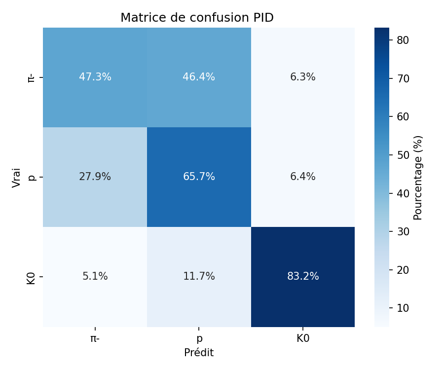
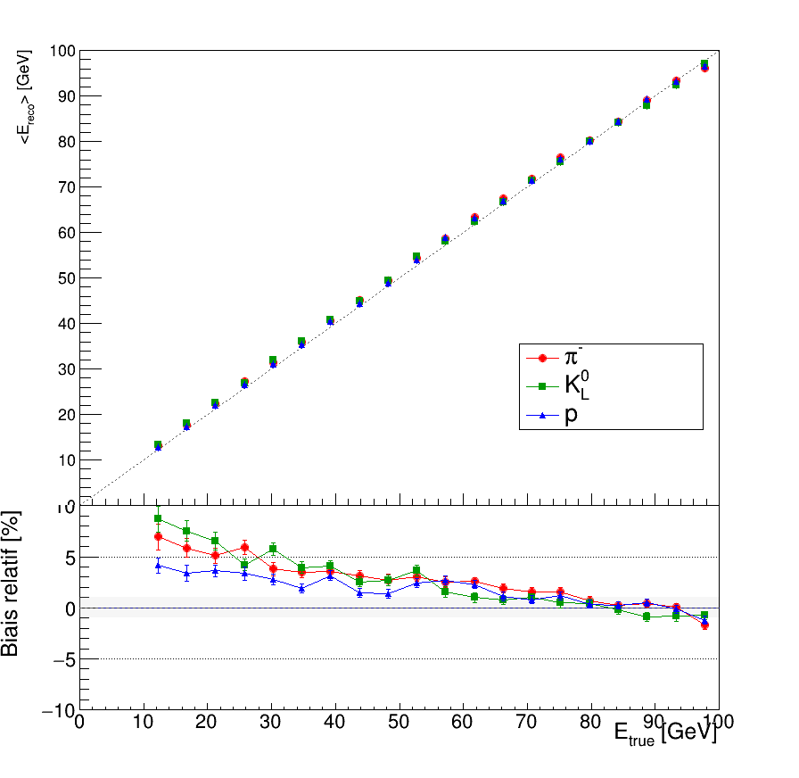
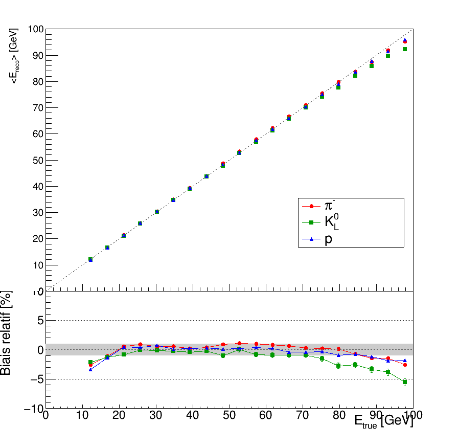

# SDHCAL Particle Identification and Energy Reconstruction

This repository contains my M2 internship research software for studying particle identification and energy reconstruction in a Semi-Digital Hadronic Calorimeter (SDHCAL). It combines ROOT/C++ shower-parameter extraction with machine-learning and chi2/TMinuit reconstruction studies for simulated hadronic showers, with an emphasis on clear analysis workflows rather than a production-ready experiment framework.

**Skills demonstrated**

- Particle-physics data analysis with ROOT/C++, LCIO-derived detector outputs, and shower observables.
- Supervised learning for hadron PID using LightGBM BDTs, scikit-learn MLPs, and exploratory graph neural networks.
- Energy reconstruction with both ML regressors and a semi-digital chi2/TMinuit calibration approach.
- Reproducible research organization: parameter logs, performance tables, plots, and method comparisons.
- Scientific communication through documented pipelines, result summaries, and portfolio-oriented repository structure.

## Project Overview

The SDHCAL is a highly granular hadronic calorimeter concept using semi-digital readout: each cell records threshold information rather than a fully analog energy deposit. This readout is well suited to imaging hadronic showers, but it also makes reconstruction dependent on shower topology, threshold occupancies, and calibration choices.

The project investigates two connected tasks:

1. **Particle identification (PID)** for simulated pi-, K0, and proton showers.
2. **Energy reconstruction** using shower features, semi-digital hit counts, and particle-dependent or particle-aware reconstruction strategies.

The repository is meant to show the analysis logic, code organization, and representative outputs from the internship. Large datasets and trained artifacts are not versioned.

## Physics Motivation

Hadronic calorimetry is challenging because hadron showers fluctuate strongly event by event. In a semi-digital detector, the information available per hit is compressed into threshold levels, so reconstruction relies on both counting information and spatial shower development. Useful PID and energy estimators can exploit:

- longitudinal shower development, such as first active layers, barycentres, RMS, and fitted profile quantities;
- transverse morphology, such as density, radius, eccentricity, and clustering;
- semi-digital threshold content, such as N1, N2, N3, Thr1, Thr2, Thr3, and threshold ratios;
- timing or timing-derived features where available;
- correlations between the particle hypothesis and the optimal energy reconstruction.

## Detector and Data Context

The analysis is based on simulated SDHCAL-like samples. The full upstream chain is external to this repository:

```text
SDHCAL simulation (.slcio)
        -> digitization (.slcio)
        -> LCIO to ROOT conversion
        -> shower-parameter extraction
        -> PID and energy reconstruction studies
```

The repository assumes ROOT trees containing either per-hit detector information or derived shower parameters. Many scripts still contain local research-path defaults from the internship environment; for reuse, those paths should be changed to local data locations.

## Main Objectives

- Extract physically interpretable shower variables from digitized calorimeter hits.
- Compare hadronic shower variables across particle species.
- Train and evaluate PID models for pi-, K0, and proton separation.
- Reconstruct incident energy using ML regression and chi2/TMinuit semi-digital calibration.
- Study how PID decisions affect downstream energy reconstruction.

## Methods

**Shower feature extraction**

- ROOT/C++ event loop over digitized hits.
- Computation of threshold counts, shower start, barycentre, RMS, density, radius, clustering, longitudinal-profile quantities, timing summaries, and topology features.
- Main code: `ShowerAnalyzer/`.

**Particle identification**

- LightGBM BDT classifiers using engineered shower variables.
- scikit-learn MLP baselines with standardization and SMOTE in selected scripts.
- Exploratory PyTorch Geometric GNN models using hit-level or graph-like shower representations.
- Main code: `PID/`.

**Energy reconstruction**

- LightGBM and MLP regression models trained on derived shower parameters.
- ROOT/C++ chi2 calibration with TMinuit using semi-digital hit counts N1, N2, and N3.
- Main code: `Energy_reconstruction_ml/` and `energy_reconstruction_Tminuit/`.

**PID-energy coupling**

- Comparisons of reconstruction performance with and without PID-informed model selection.
- Main code: `PID_RECONSTRUCTION/`.

## Repository Structure

```text
.
|-- ShowerAnalyzer/                  ROOT/C++ shower-parameter extraction
|-- PID/                             PID studies with BDT, MLP, GNN, RF, CNN variants
|   |-- BDT/                         LightGBM PID classifiers and interpretation plots
|   |-- MLP/                         scikit-learn MLP PID classifiers
|   `-- GNN/                         exploratory PyTorch Geometric PID studies
|-- Energy_reconstruction_ml/        ML-based energy reconstruction
|   |-- BDT/                         LightGBM regressors and plots
|   `-- MLP/                         MLP energy-regression studies
|-- energy_reconstruction_Tminuit/   ROOT/TMinuit chi2 energy reconstruction
|-- compare_parameters/              ROOT macros and figures comparing shower variables
|-- PID_RECONSTRUCTION/              PID-aware vs non-PID energy reconstruction studies
|-- tools/                           Utility scripts for visualization and track counting
|-- results/                         Curated result and plot folders moved with git mv
|-- docs/                            Human-readable project documentation
|-- CITATION.cff                     Suggested citation metadata
`-- LICENSE.md                       Non-binding license selection note
```

See also:

- [Project overview](docs/project_overview.md)
- [Data pipeline](docs/data_pipeline.md)
- [Model summary](docs/model_summary.md)
- [Results summary](docs/results_summary.md)
- [Repository map](docs/repository_map.md)

## Data Availability

The raw, digitized, converted ROOT files, generated CSV tables, trained models, and large intermediate arrays are not included in this repository. They are too large for GitHub and depend on external simulation and reconstruction environments.

In principle, the data chain depends on external tools such as SDHCAL simulation, digitization, LCIO/Marlin processing, ROOT, and local storage paths. Lightweight figures and selected performance summaries are kept in the repository when useful for review.

## Reproduction in Principle

The repository is not packaged as a one-command reproduction workflow. A new user would need to:

1. Generate or obtain compatible SDHCAL simulated samples.
2. Digitize the simulated events and convert them to ROOT trees.
3. Run the ROOT/C++ shower-parameter extraction in `ShowerAnalyzer/`.
4. Update hard-coded data paths in the PID and energy scripts.
5. Install the relevant Python packages: `numpy`, `pandas`, `uproot`, `scikit-learn`, `lightgbm`, `imbalanced-learn`, `joblib`, `matplotlib`, and optionally `torch`/`torch_geometric`.
6. Re-run only the desired PID or energy reconstruction study, keeping train/test splits and seeds fixed where possible.

This documentation update did not recompile code, rerun training, regenerate plots, or modify scientific algorithms.

## Representative Results and Figures

The figures below are examples of outputs currently stored in the repository. They are included as visual evidence of the analysis workflow, not as a claim of publication-level performance.

<p align="center">
  
  
  
</p>

Additional useful figure locations:

- `results/pid/bdt/feature-interpretation/` - LightGBM feature-importance, SHAP-style summaries, and tree visualizations.
- `PID/GNN/plots/` - GNN training and confusion-matrix plots.
- `Energy_reconstruction_ml/BDT/plots/` - ML energy linearity, relative deviation, and resolution plots.
- `Energy_reconstruction_ml/MLP/results_*_energy_reco/plots/` - MLP regression curves by particle category.
- `results/energy-reconstruction/chi2-tminuit/summary-plots/` - chi2/TMinuit reconstruction profiles and diagnostics.
- `results/shower-variables/plots/` - shower-variable overlays and comparisons.
- `results/pid-energy-coupling/summary/` - PID-energy coupling summary confusion matrices.
- `PID_RECONSTRUCTION/*/plots/` - comparisons of PID-aware and non-PID energy reconstruction.

## Limitations

- The repository does not include the large input datasets needed for direct reruns.
- Several scripts contain absolute paths from the internship computing environment.
- The workflows are research scripts rather than a single maintained package or command-line interface.
- Some studies are exploratory and compare multiple model variants without a final unified benchmark table.
- Existing figures should be interpreted in the context of the specific simulated samples, splits, and configuration files used at the time.

## Future Improvements

- Replace hard-coded data paths with configuration files or command-line arguments across all scripts.
- Add a small public toy sample or synthetic fixture for smoke tests.
- Add environment files for Python and ROOT versions.
- Consolidate metrics into one reproducible summary table.
- Add lightweight tests for feature extraction and data-loading assumptions.
- Record exact dataset provenance and split identifiers for every reported figure.

## Citation

If this repository is useful for orientation or comparison, please cite it using the metadata in [CITATION.cff](CITATION.cff). The repository represents internship research software, not a peer-reviewed publication.

## License

No final license has been selected yet. See [LICENSE.md](LICENSE.md) for a non-binding recommendation. A permissive code license such as MIT or BSD-3-Clause would usually be appropriate for portfolio research code, but dataset rights, collaboration rules, and figure ownership should be checked before choosing one.

## Contact

**Author:** IDIR Mohamed Yanis

**Email:** yanis.idr@outlook.fr
